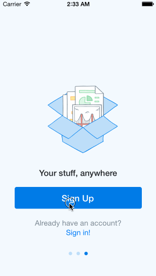

# Dropbox Click-Through Prototype

Description...

Time Spent: 7 hours

Completed User Stories:
* [x] User can tap through the 3 welcome screens.
* [x] User can follow the create user flow.
  * [x] On the create user form, the user can tap the back button to go to the page where they can sign in or create an account.
  * [x] Before creating the account, user can choose to read the terms of service.
  * [x] After creating the account, user can view the placeholders for Files, Photos, and Favorites as well as the Settings screen.
  * [x] User can log out from the Settings screen.
* [x] User can follow the sign in flow.
  * [x] User can tap the area for "Having trouble signing in?"
  * [x] User can log out from the Settings screen.
* [ ] Optional: Add a detail view for one of the files and implement favoriting the file.
* [ ] Optional: Add UITextFields for the forms so you can actually type in them and handle dismissing the keyboard.
* [ ] Optional: You should be able to swipe through the welcome screens instead of just tapping them.

Notes:

Took a bit of troubleshooting to get the back buttons to work properly for welcome from every screen. Ended up not making the Sign In and Account Creation views separate, but rather kept them as one view and changed the background image programatically.

Also spent a lot of time trying to figure out how to get the Sign Out to go to the Logged Out screen rather than jumping to the account creation screen, but Tim said we don't have to do that via FB group.

Walkthrough of all user stories:

GIF created with [LiceCap](http://www.cockos.com/licecap/).
